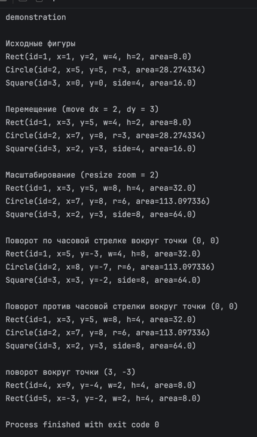

## Описание
1. Реализовано наследование `Rect`, `Circle`, `Square` от базового класса `Figure`
2. Реализованы интерфейсы `Movable` и `Transforming` (методы `move`, `resize`, `rotate`)
3. При повороте прямоугольника на 90 градусов его ширина и высота корректно меняются местами
4. В файле `Main.kt` протестированы все операции

## Демонстрация работы (Вывод в консоль)

